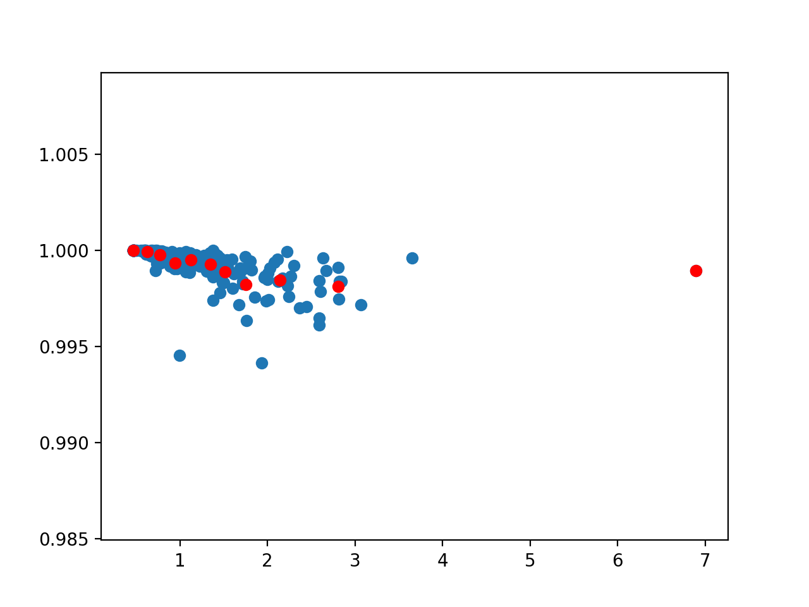

### Lubov McKone and Anna Goncharova: Project 2 Submission

## General Purpose

Boston is a growing city characterized by both rapid economic growth and, increasingly, housing instability. Our analysis takes a look at potential relationships between businesses and housing instability in the City of Boston. After retireving data on eviction, crime, businesses, and income and aggregating them by census tract, we were able to take a closer look at the relationships between our variables of interest. Using the insight gained from our analysis, we created a mock optimization that finds placements of businesses that minimize the overall increase in housing instability that they could potentially cause.

## Data Retreival

1. **Businesses**

	We queried the [Foursquare API](https://developer.foursquare.com/docs) to get data about businesses in Boston. To work around Foursquare's query limit of 50 data points per request, we created a lattice of longitute and latitude points. We preserved unique data points returned with our query for "Office" and different longitute and latitude pairs. In total, we were able to retrieve 1478 data points. 

2. **Permits**
	
	We gathered [permit data](https://data.boston.gov/dataset/approved-building-permits) using the Analyze Boston CKAN API. This data contains information about approved changes to the built environment such as new constructions, additions, and remodeling.

3. **Evictions**
	
	We collaborated with the City of Boston Office of Housing Stability to retrieve [eviction data](http://datamechanics.io/data/evictions_boston.csv) for Boston from 2014-2016. 

4. **Crime**

	We gathered [crime data](https://data.boston.gov/dataset/crime-incident-reports-august-2015-to-date-source-new-system) using the Analyze Boston CKAN API.

5. **Income**

	We used the [Census Data API python wrapper](https://github.com/datamade/census) to retrieve median income by census tract in Boston. 

6. **Census Tracts**

	We retrieved the census tract [shapefile for Massachusetts](https://www.census.gov/cgi-bin/geo/shapefiles/index.php) and filtered it for Boston. We used QGIS to convert it into a GeoJSON file and retrieved it from datamechanics.io

## Aggregation and Scoring

After gathering our data, we created a normalized "stability score" that measures the housing instability of a given census tract using the indicators noted as significant in [this paper](https://www.sciencedirect.com/science/article/pii/S0049089X16300977) by housing scholar Matthew Desmond (eviction rate and crime rate).

## Statistical Analysis

To investigate the relationships within our data, we ran some basic correlations. We found that businesses has a 0.1 correlation with stability score (p=0.14), a detail we used in our optimization. 

We were also curious whether the relationship between number of businesses and number of evictions in a given census tract changes given the median income of that census tract. To investigate this, we found the quartiles of the distribution of median incomes of each census tract. We then partitioned the data into four segements representing different income levels - low income, low-medium income, high-medium income, and high income. 

Interestingly, we found that the correlation between number of businesses and number of evictions was small and negative for the lowest three income grades. However, the correlation between business and evictions in the high income census tracts was 0.21. 

This indicates that the interaction between businesses and evictions changes based on the demographic of a geographic area, an insight that we may use in a later implementation of our optimization. 

## Optimization

In our quest to learn most from the data we have (evictions, census, business (soure: Foursquare API) data), we developed a custom metric, the stability score. We then ran k-means algorithm as well as piped our data through the SMT solver to gain some valuable insights, as well as explore the use of these Computer Science techniques.

### K-means
We ran k-means on the following combinations of data points: evictions and stability score, crime and stability score, crime and evictions and stability.
We found that our data isn't highly segregated into particular pockets, so we learned that our data is evenly distributed. 

Here is a graph of a result of performing k-means on crime and eviction and stability score combination, with 11 clusters.

### SMT 
In order to see whether it would be possible to gain insights into the relationships between the stability score and the number of businesses in a particular Boston-area census tract, we computed the correlation statistic on the "# of businesses" and "stability score". We found that the correlation was 0.1, which affirmed our intuition that there might be a relationship. Therefore, we implemented an SMT solver using the z3 library to compute the "optimal score". We invented an algorithm for computing the optimal score for a tract. The way it works is that we constrain the number of businesses it would be possible to add to an area. Then we assign a specific weight that a single businesses added might have on the stability score. Then we use the minimize function of Optimize z3 object to find the minimized optimal score from the stability score.

* note: in order to run optimal_score.py, you will need to replace 

'sys.path.append("/Users/lubovmckone/course-2018-spr-proj/agoncharova_lmckone/z3/build/python/")'{:.language-python}

with your own path to the z3/build/python folder

 