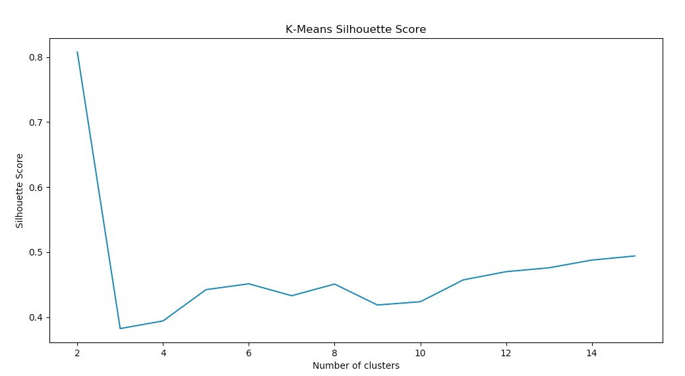

## Fire Incidents KMeans

I used the Fire Incident reports in Boston from May, September, and December of 2017. I first transformed the data to include only the unique incident numbers and the address, then I used geocoder to convert the addresses to latitude and longitude points. I then used that information to do three K-Means for each of the months. I wanted to determine if during the month of September, the fire incidents clustered closer to areas that students live in, such as Allston and Medford.

I used two clusters for each month, based on a k-means silhoutte score for the data from the month of May.

Upon running this file, I found:

May Centroids =  [[ 42.34223224 -71.06216747] (South End, 02118)
                  [ 42.31453459 -71.14446154]] (Brookline, 02467)

September Centroids =  [[ 42.30666775 -71.10363356] (Jamaica Plain, 02130)
                        [ 42.3533682  -71.06483576]] (Boston, 02108)

December Centroids =  [[ 42.28743448 -71.09755387] (Mattapan, 02124)
                       [ 42.34583514 -71.07241684]] (Back Bay, 02116)
