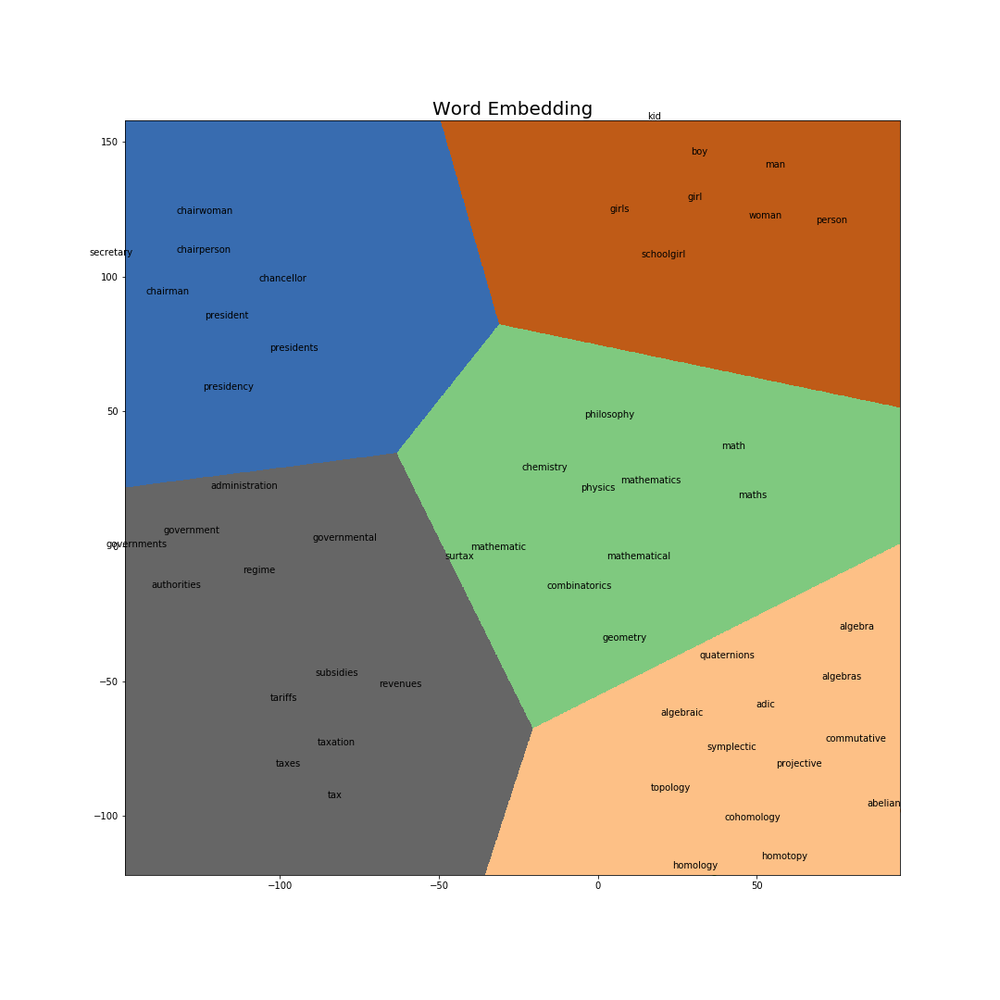
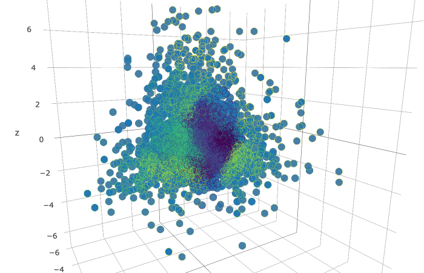
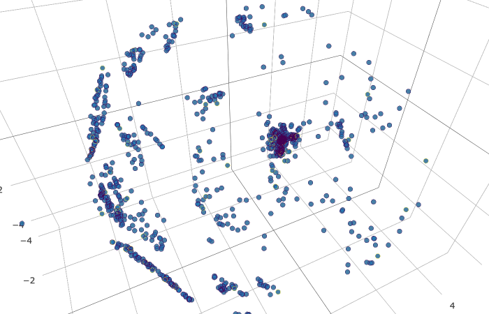
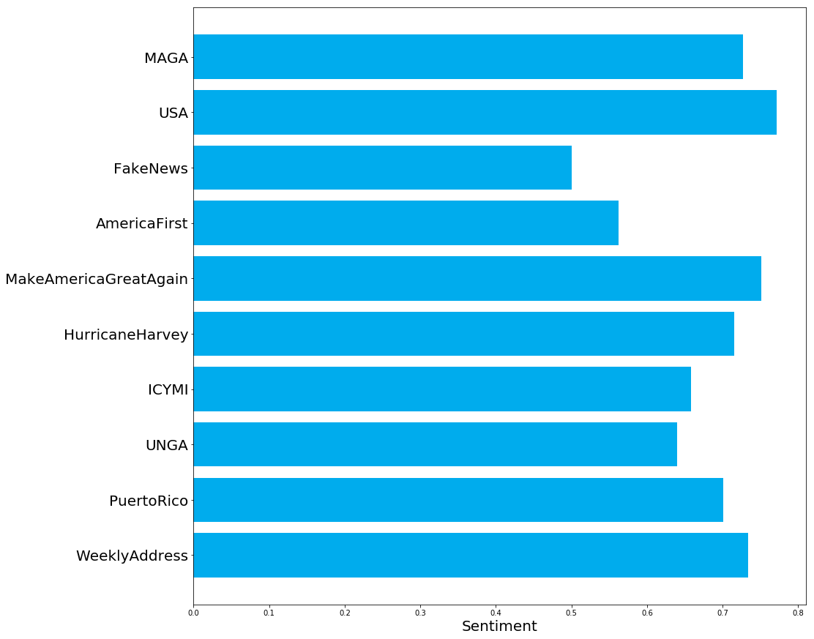
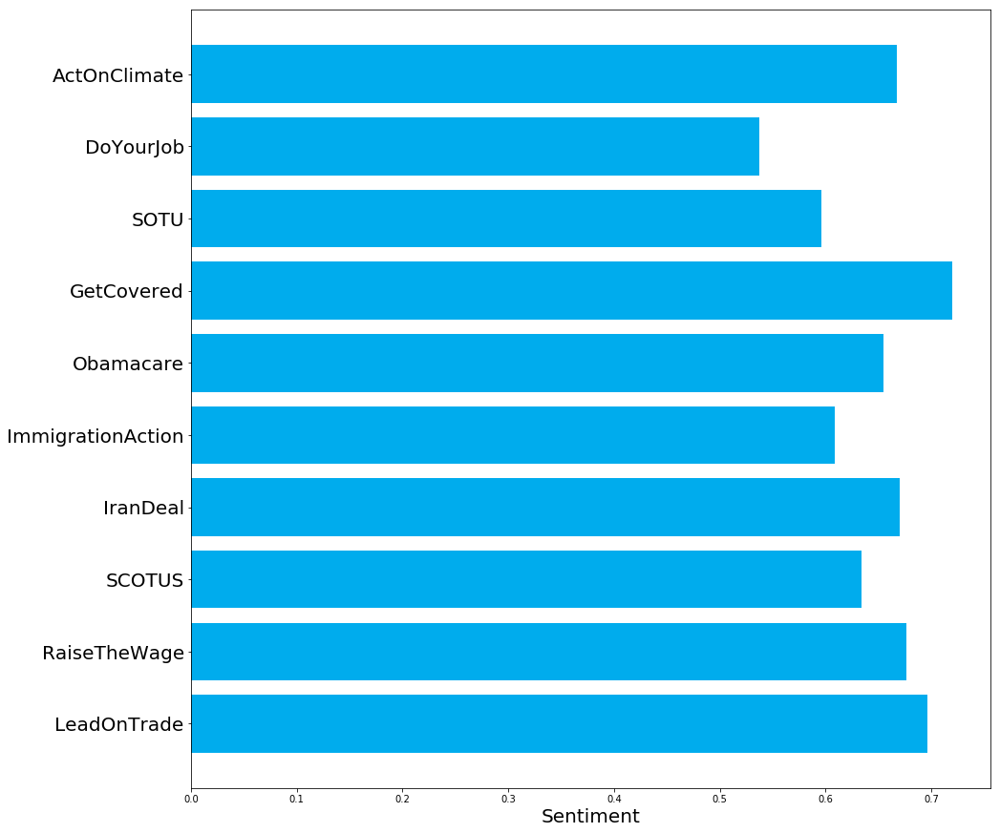
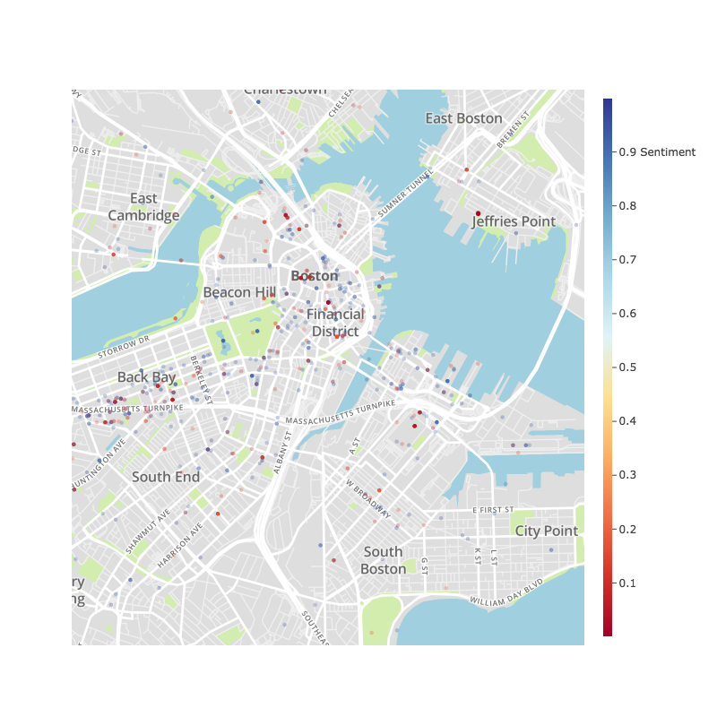

## CS591: Urban Sentiment Analysis
## Members:  
- Kai Bernardini
- Vasily Ilin


# Final Project Overview:
Sentiment analysis, aka opinion mining, is used to gauge opinions of the population or a subset of the population on a specific product or entity. For example, it is often used to see which brands people feel most positively about. Using a logistic regression trained on 1.6 million tweets with labeled sentiment we built a live classifier of tweets, which appends the sentiment of each incoming tweet to the metadata of the tweet. We then used the sentiment data in a few ways:
For each politician with a public twitter account we calculated the average sentiment for each hashtag the politician used in the past 3000 tweets. This allows for claims like “Donald Trump feels more positively about making America great again then about fake news,” since Trump’s average sentiment for hashtag #MAGA is significantly higher than for #FakeNews
For tweets in Massachusetts we plotted them on the map, filtering by a hashtag and changing the color of the point according to the sentiment of the tweet. This allows one to visually observe how people in Massachusetts feel about specific hashtags.


In addition to analyzing politicians’ sentiment about specific hashtags, we constructed word clouds for each one, based on the hashtags they have used most frequently in the past 3000 tweets. This allows one to see what the politician cares more about at a glance.


The same techniques can be extended to the whole US area. We have built a tool to make heatmaps of a specific topic on the national level using hashtags. Utilizing a word2vec model we built from the wikipedia corpus, we were able to find words that are similar to the specified hashtag and plot on the maps of United States all tweets that contain either the specified hashtag or any of the similar hashtags. This is a step in the direction of topic modeling, where the sentiment of a whole topic is gauged as opposed to just an individual hahstag.


Using tweepy, an open source python wrapper for Twitter's dev API, and an annotated tweet sentiment dataset, we
construct a fully end to end Machine Learning pipeline for predicting aggregate sentiment by region.
- There is functionality fo constructing twitter word clouds for arbitrary hashtag sentiment and specific user sentiment.
  - e.g., you can construct word clouds for a region like MA or a specific user like @realDonaldTrump
- note:  As this is predominantly exploratory,  technical short cuts were taken.

## Future Work:
- Sentiment analyzer for News API article headlines
- Correlate Twitter Sentiment with Article Sentiment
- Political Research using Twitter text mining.

## Dependencies

```python
pip install -r requirements.txt
```


# Datasets and Authentication
Before getting started, you must acquire several authentication tokens
Please modify [auth.json](https://github.com/kaidb/course-2018-spr-proj/blob/master/auth.json)

You will need the following
- Twitter Consumer API key
- Consumer Secret key
- Access Key
- Access Secret Key
- [Mapbox Access Token](https://www.mapbox.com/signin/?route-to=%22/account/access-tokens%22)

For all twitter access tokens, sign up [here](https://apps.twitter.com/)

```python
{
"consumer_key": "",
"consumer_secret": "",
"access_key": "",
"access_secret": "",
"mapbox_access_token":""
}
```

A preprocessed Dataset of scored tweets is located [here](https://drive.google.com/open?id=1Lp5N2vNMYqoPMQkCOExjS6CWCwWg3PSq)
Please download this file to ./Twitter_to_vec/

## Building the Sentiment Classifier
- execute the following to
1) download and parse all data and 2) train and validate the sentiment Classifier
Both scripts are located [here](https://github.com/kaidb/course-2018-spr-proj/tree/master/kaidb_vilin/Twitter_to_vec) and must be run from the correct directory.

```python
bash build_model.sh
```


- Optionally, to build the word2vec model

```python
bash build_word2vec.sh
```

- to run in trial mode,

```python
$ python Twitter_to_vec/get_clean_twitter_sentiment.py t
```

- Trial mode will only tokenize and stem the first few tweets for illustrative purposes, but I recommend just running the full pipeline and getting a coffee.


- The word2vec model is incredibly effective at identifying useful embeddings for profanity, slang, and spelling associations and is not useful for word embeddings for arbitrary texts.
- Full pipeline is
```bash
get_clean_twitter_sentiment.py
build_twitter_tweet_2_vec.py
sentiment_model_l2_LR.py
```

- the first script will retrieve the data, save it, stem/tokenize it, and save it. This is available in trial mode
- The second one will build a word2vec model using the saved data. This is also available in trial mode
- The final one will build a Logistic Regression model on the training set and validate it. Trial mode is left out in lieu of loading a prebuilt model.


## Twitter Live stream using tweepy
- We provide several high level  scripts to allow for easy retrieving of tweets
    - Tweet streaming by Geographical Location :
    - Tweets by User
- For either usecase, you are required to create a twitter app an input the following into ```auth.json```:


## Tweet Word Embedding Examples
** Disclaimer: These associations are constructed by the tweet. word2vec model. These associations are not reflective of our views. **
** Trigger Warning: Profanity, slurs...etc **

```python
print(word2vec.wv.similar_by_word("lol"))
[('hah', 0.7501074075698853), ('lmao', 0.7403647899627686), ('hahah', 0.6293175220489502), ('hahahah', 0.4980482757091522), ('lmfao', 0.4653286337852478), ('heh', 0.46210041642189026), ('cuz', 0.4489451050758362), ('ha', 0.4350995123386383), ('jus', 0.4144180417060852), ('u', 0.41266563534736633)]
```

```python
print(word2vec.wv.similar_by_word("fuck"))
[('fuckin', 0.5401198863983154), ('shit', 0.47455620765686035), ('damn', 0.47374287247657776), ('eff', 0.4427247643470764), ('ugh', 0.42223554849624634), ('bitch', 0.41461408138275146), ('stupid', 0.39982643723487854), ('screw', 0.37740325927734375), ('wtf', 0.3753121793270111), ('freakin', 0.37031519412994385)]
```

```python
print(word2vec.wv.similar_by_word("dumb"))
[('stupid', 0.4474240839481354), ('lam', 0.44008922576904297), ('retard', 0.3861704468727112), ('smart', 0.3855532705783844), ('weird', 0.37820345163345337), ('gay', 0.3473893404006958), ('funny', 0.33632892370224), ('confus', 0.3293963372707367), ('annoy', 0.3184397220611572), ('bad', 0.2968796491622925)]
```
## Wikipedia Corpus
- The latest wikipedia dataset is located at   -https://dumps.wikimedia.org/enwiki/latest/
    - The dataset we used is at -https://dumps.wikimedia.org/enwiki/latest/enwiki-latest-pages-articles.xml.bz2
        - Note that the Mirror to download is prohibitively slow. Please email me at kaidb@bu.edu and I will share the google drive containing the data (way, way faster)
        - The zipped size is ~14GBs
        - Unzipped size is ~65GBs
    - Data is then unpacked from its xml format, tokenized, and a word2vec model is constructed from it.
        - This model is too large to fit in github. For a copy, please email me and I will share the drive containing the model.
            - Useful for word embeddings for article titles (language tends to be grammatically correct)

## Visualization of Word2Vec
- Since every single word in the vocabulary has a representation as a vector in a vector space, we can apply traditional dimensionality reduction techniques. For example, with a small sample of words, we can take all vectors in our vocabulary that have a cosine similarity of at least .5  and stack those vectors into a datamatrix. From there, we can reduce the dimensionality using PCA and then run [T-SNE](http://www.jmlr.org/papers/v9/vandermaaten08a.html)
 to reduce the number of dimensions to 2. Finally, we can run K-means on the embedded data to produce a Voroni Partition.
Taking a random smaple of 10,000 words in the vocabulary, we can also visualize the topology of the space. Using PCA to reduce the number of dimensions to 3, and kmeans for coloring, we view the following.

We can also use TSNE and reduce the number of dimension to 3.


There is an interactive version [here](https://github.com/kaidb/course-2018-spr-proj/blob/master/kaidb_vilin/Twitter_to_vec/Tweet_2_vec_3d_visualization.ipynb)


## Optimization and Statistical Analysis:

- Word2Vec uses Gensim
- Gradient Descent with Momentum written from scratch :
    - See Ipython Notebook in Tweet2Vec for this

- Sadly, this implementation does not support sparse matrices
- Tweets are turned into vectors using [TFIDF](https://en.wikipedia.org/wiki/Tf%E2%80%93idf) weighting, and the top 160,000 dimension are kept.
- This is an incredibly sparse matrix
- If a dense matrix was used, it would require over 1 terabyte of RAM
- With sparse matricies, not only can we fit it in memory, but we can also build models.
- A Logistic Regression with L2 Regularization is used
- L1 regularization produced poor classification results, since rare words were zeroed out due to the sparsity constraint on the parameters
- The dataset is divided into training, testing, and validation.
- The training set accounts for most of the data (over 1 million tweets)
- A TFIDF vectorizer is built on this data.
- The regularization parameters is selected via 5 fold cross validation, and the parameter that produced the best accuracy on the validation set is selected (turns out lambda=1 works best)
- Final statistical analysis is performed on the testing set.
- A testing accuracy of 82% is achieved
- An AUC score of .9 is achieved


## Visualization
## Visualizing Sentiment Data
Using the  [politician sentiment plotter](https://github.com/kaidb/course-2018-spr-proj/blob/master/kaidb_vilin/Tweet_Stream/Politician_plot.ipynb), we can construct word clouds based around number of times a particular hashtag was used by a user. The class of users explored in this project is politicians. We use the CSPAN list of politicians to construct tweet histories, and sentiment scores for each politician. From there, we can observe average sentiment for a particular hashtag. While the data is included in the repo [here](https://github.com/kaidb/course-2018-spr-proj/tree/master/kaidb_vilin/Twitter_to_vec/user_tweets), you can generate your own dataset by running
```python
python Twitter_to_vec/get_user_and_classify.py BarackObama realDonaldTrump
```
Note it will iterate over all sys args, so you can pass a large list in as an input. A full list of political accounts maintained by CSPAN is available [here](https://github.com/kaidb/course-2018-spr-proj/blob/master/kaidb_vilin/Twitter_to_vec/twitter_politician_CSPAN_group.ipynb)

Example:

```python
python Twitter_to_vec/get_user_and_classify.py BarackObama realDonaldTrump
```

After, the code [here](python Twitter_to_vec/get_user_and_classify.py BarackObama realDonaldTrump) with users `BarackObama realDonaldTrump`
and the following charts will be generated:

#Trump Word Cloud and Sentiment Chart


# Obama Word Cloud and Sentiment Chart




# MA Tweet dataset
As previously mentioned, around 400,000 tweets were scraped from the Boston area over the course of a few weeks. The tweets were all tokenized, stemmed, and classified. An interactive map with tweets is available [here](https://github.com/kaidb/course-2018-spr-proj/blob/master/kaidb_vilin/Tweet_Stream/sentiment_plotting.ipynb)
A snapshot is included below.

